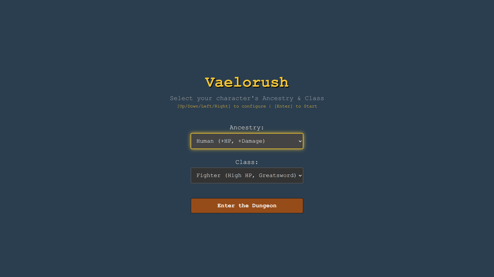
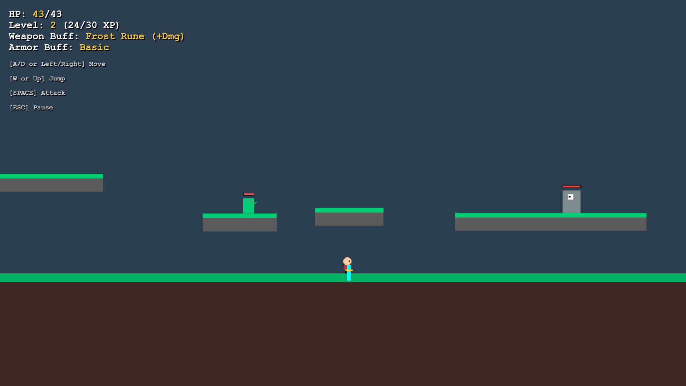
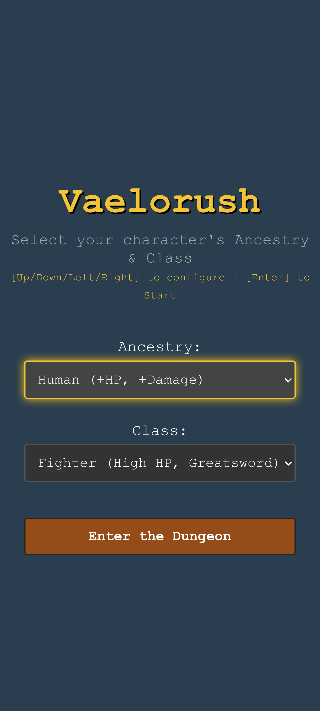
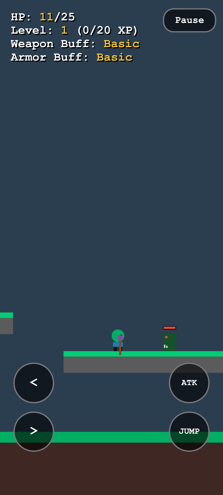

# Vaelorush

An endless, procedurally generated 2D action-platformer built entirely in vanilla HTML5, CSS3, and JavaScript. Inspired by Pathfinder 2nd Edition (PF2e) mechanics, **Vaelorush** challenges players to descend into an infinite dungeon, level up, collect unique loot, and survive monstrous threats.

| Main Menu (on PC)| Running (on PC)|
|---|---|
|  | |

| Main Menu (on Mobile)| Running (on Mobile)|
|---|---|
|  | |

---

## 🎮 Play & Controls

You can play the game both locally:

* Open `index.html` directly in any modern desktop or mobile web browser to play instantly—no installation or build steps required.

or online:

* Visit: https://vapoafe.github.io/vaelorush

### PC Controls
* **Movement**: `A` / `D` or `Left` / `Right` Arrow keys

* **Jump**: `W` or `Up` Arrow key *(Supports double jumps for specific classes)*

* **Attack**: `SPACEBAR`

* **Pause / Menu Selection**: `ESC` to toggle pause, `W`/`S` or Arrow keys to navigate, `ENTER` or `SPACEBAR` to confirm options.

### Mobile / Touch Controls
* **Direction Pads**: To move left or right, tap on `<` and `>` overlays.

* **Action Buttons**: Dedicated nodes for `ATK` and `JUMP`.

* **`Pause` Button**: Safely toggles the pause menu.

---

## ⚔️ Key Game Features

### 1. Pathfinder 2e Character Builds
Mix and match unique **Ancestries** and **Classes** at the start screen to alter your physical hitboxes, base speeds, damage metrics, and combat mechanics:
* **Ancestries**: Choose from *Human* (balanced), *Elf* (high speed/jump, fragile), *Dwarf* (tanky, slower), *Halfling* (small hitbox), *Goblin* (hyper-fast, low damage), or *Orc* (brutal strength and high health).
* **Classes**: Play as a *Fighter* (high health melee), *Rogue* (fast attack speeds, double jump), *Wizard* (projecting magic missiles), *Cleric* (passive auto-regeneration over time), or *Ranger* (fast ranged archery projectile velocity).

### 2. Dynamic Difficulty Levels
Tweak game settings via the keyboard-navigable Pause Menu. Scale monster attributes across 4 levels of challenge:
* **Easy** (0.7x stats)
* **Normal** (1.0x baseline stats)
* **Hard** (1.5x stats)
* **Nightmare** (2.5x hardcore scaling stats)

### 3. Infinite Generation & Clean Memory Footprint
A lightweight chunking layout system creates endless variations of ground segments and floating, mossy stone ledges ahead of the player.

To ensure flawless 60 FPS performance over long sessions, an active **Garbage Collector engine** automatically de-allocates platforms, off-screen items, and distant entities trailing 3,000 pixels behind the player.

### 4. Advanced Drawing with Procedural Visuals
Instead of utilizing bloated, network-reliant external sprite images, *Vaelorush* leverages pure HTML5 Canvas coordinates to procedurally sketch entity models:
* **Animated Movement**: The player and monster entities utilize mathematical walk-cycles, swaying limbs back and forth based on their actual velocities.

* **Unique Bestiary Art**: Goblins feature distinct geometric pointy ears, Orcs render custom protruding white tusks, and Ogres scale up with single cyclopic, tracking eye pupils.

* **Active Weapon Rigidbodies**: Held items (Staffs, Bows, Greatswords) render directly from the body center and dynamically pivot through mathematical angle rotations during swinging attack frames.

### 5. Web Audio Synth Engine
Featuring a zero-file procedural chiptune audio synthesizer powered exclusively by the native browser **Web Audio API**. It hooks into device event interactions to instantiate real-time waves:

* **Monster Death**: Triggers a low-pass sawtooth synthesizer frequency crunch ramping downwards.

* **Loot Grabs**: Generates a high-pitched dual triangle arpeggio ring ($D_5 \to A_5$).

* **Level Ups**: Runs a triumphant ascending classic 8-bit chiptune major pentatonic sound scale ($C \to E \to G \to C \to E$).

---

## 🛠️ Technical Implementation Details

* **Language**: Vanilla JavaScript (ES6+), HTML5, CSS3.

* **Rendering Pipeline**: HTML5 2D Canvas context (`requestAnimationFrame` core clock loop).

* **State Management**: Linear conditional state machine handling `menu`, `playing`, `paused`, and `gameover`.

* **Physics Engine**: Axis-Aligned Bounding Box (**AABB**) intersection mapping handling independent velocity vectors, friction damping, constant gravity, and discrete multi-axis separation sweeps.

---

## 📝 License

See the accompanying [LICENSE.md](./LICENSE.md) file for the full terms and attribution text.